```{=latex}
\begin{center}
\vspace*{0.3\baselineskip}
{\fontsize{16pt}{24pt}\selectfont\boldheiti 基于骑行记录与历史天气的共享单车需求预测与调度分析：\par}
{\fontsize{16pt}{24pt}\selectfont\boldheiti 一项端到端数据挖掘研究\par}
\vspace{0.3\baselineskip}
{\fontsize{14pt}{21pt}\selectfont\heiti 数据分析与数据挖掘·期末项目（选项 C：端到端应用系统开发）\par}
\vspace{0.3\baselineskip}
{\fontsize{12pt}{18pt}\selectfont\songti 任泓臻（2351458）\quad 虞澍（2352979）\quad 黄彦炜（2353117）\quad 马小龙（2353814）\par}
\vspace{0.3\baselineskip}
{\fontsize{12pt}{18pt}\selectfont\songti 2026 年 6 月\par}
\vspace{0.3\baselineskip}
{\fontsize{14pt}{21pt}\selectfont\heiti 摘要\par}
\end{center}

{\fontsize{12pt}{18pt}\selectfont\songti
共享单车系统在运营中面临需求波动大、站点车辆不均衡、天气与节假日扰动明显等问题，其根本难点在于需求随时间与空间的剧烈起伏，以及由此造成的车辆失衡。每一次骑行都会将一辆车从一处转移到另一处，使部分站点很快借空，而另一些站点不断积压。本项目以美国华盛顿特区 Capital Bikeshare 自 2023 年 1 月至 2025 年 12 月的官方骑行记录为核心数据，在小时尺度上融合 Open-Meteo 历史天气与美国联邦节假日特征，构建了一条可完整复现的数据挖掘流程，依次完成记录级清洗、小时级聚合、多源融合、特征工程、模型训练与站点级分析，并最终落地为交互式 Dashboard。在 26,304 个小时级样本上，本研究以严格的时间顺序将数据按 80/20 划分为训练集与测试集，对全系统出发量进行六类模型的对比。结果表明，基于直方图的梯度提升模型 HGB 取得最低测试误差，其 RMSE 为 116.95、MAE 为 84.29，决定系数 $R^2$ 达 0.964，不仅大幅领先 RMSE 为 300.74 的周期基线，在 RMSE 上亦优于 LSTM 的 127.27，尽管两者 MAE 几乎相当。本项目进一步刻画了研究期内一项显著的结构变迁，即电动车占比由 0.35 近乎翻倍至 0.67；在日尺度上量化了天气弹性，降水日与低温日的需求分别回落至常规日的 0.75 倍与 0.60 倍；并对流量最高的 20 个站点预测小时级净需求，结合 K-Means 画像与峰值不平衡评分，输出可解释的补车与清车建议。本文一项贯穿始终的发现在于，站点的全时段均值流量与其高峰时段的不平衡属于两类相互独立的信号，若干日均看似平衡的枢纽仍需在高峰时段实施定向调车。\par}
\vspace{0.2\baselineskip}
{\fontsize{10.5pt}{16pt}\selectfont\noindent{\heiti GitHub 仓库：}\songti https://github.com/traveler703/BikeShareDemand \par}
\vspace{0.2\baselineskip}
{\fontsize{10.5pt}{16pt}\selectfont\noindent{\heiti 关键词：}\songti 共享单车；需求预测；多源数据融合；梯度提升树；LSTM；站点调度；时空数据挖掘。\par}
\vspace{0.5\baselineskip}
```

# 引言

## 研究背景

共享单车是城市交通的重要组成，为公共交通难以覆盖的短途“最后一公里”出行提供了补充。对运营方而言，真正的难点不在于使用量的长期平均水平，而在于需求在时间与空间上的剧烈波动。需求既受通勤与休闲节律支配，又受降水、极端气温、大风等天气因素以及法定节假日扰动；与此同时，由于每次骑行都会将一辆实体单车从一个站点转移到另一个站点，车队始终处于持续的再分配之中，时常出现一端站点借空、另一端站点积压的情形。因此，能否准确预测未来一小时的需求，能否定量判断哪些站点长期失衡，直接关系到车辆投放效率与调度成本。若运营方能够提前掌握次日经天气校正后的需求，以及各主要站点的高峰流向，便可预先布车、布人，而非待站点借空之后被动补救。

本项目的一个有利条件在于数据的开放性。Capital Bikeshare 持续公开完整的月度骑行记录，Open-Meteo 又提供可逐小时对齐的气象档案，因此整条分析链路可在不依赖任何私有运营数据的前提下复现。本文即利用这一条件，构建、记录并批判性地评估一个端到端系统，而非止步于单一模型，其链条自原始档案出发，经由特征工程，最终延伸至六个受基准评测的预测器、站点级分析与交互式 Dashboard。

## 问题定义

本项目包含三项相互关联的任务，概括于表 1。城市级任务为单目标回归，预测下一小时全系统的出发量 `cnt`。站点级任务预测各站点每小时的**净需求**，即借车与还车之差，其中正值表示站点正在失车，该指标是驱动调度的关键量。调度任务则属描述性任务，将上述站点信号转化为少量可解释的运维标签，并形成一张有序的动作清单。

Table: 任务层级。`cnt` 为小时级全系统出发量；`net_demand` 按站点定义为该小时内借车减还车。

| 层级 | 目标 | 粒度 | 运维用途 |
|---|---|---|---|
| 城市需求 | `cnt` | 小时 | 全网运力与高峰窗口 |
| 站点净需求 | Top 20 站点 `net_demand = pickup − dropoff` | 小时 | 单站失衡方向 |
| 调度 | 站点画像、聚类、补车/清车标签 | 站点、全时段 | 可解释的运维动作 |

## 研究问题

围绕上述三项任务，本研究重点回答五个相互呼应的问题。其一，小时级骑行需求在日、周、年三个尺度上是否具有稳定而清晰的周期，且这种规律是否足够强，足以支撑滞后项、滚动均值与三角周期编码等表格特征的设计，从而以相对简洁的特征刻画一个本质上属于时间序列的过程。其二，在常规、降水、高温、低温、大风等不同的日级天气下，全系统的日平均需求相对常规日呈现何种水平，这一差异能否提炼为稳定、可复现的情景倍数，既用于运营上的需求情景调整，也便于向非专业听众直观说明天气影响的量级。其三，从线性的 Ridge，到随机森林与两种梯度提升实现，再到 LSTM 深度序列模型，这一由简到繁的方法谱系在城市级预测上的误差差异有多大，而“昨日同小时”这样的朴素周期基线又会被超越到何种程度。其四，二十个高流量站点在较长时间尺度上是否存在持续且方向稳定的净流入或净流出，从而能够将真正需要重点补车或清车的站点，与仅仅波动剧烈的站点区分开来。其五，上述预测结果、站点画像与调度建议能否整合为一个可本地运行、可交互的 Dashboard，使离线的实验分析转化为可操作、可演示的产品。

## 本文贡献

与上述问题相对应，本文的主要工作可概括为五个方面。其一，项目构建了一条一键运行、完全可复现的数据管道，将原始月度档案推进至建模表、训练后的模型资产以及本报告所用的全部图表，使整项研究均可从公开数据重新生成。其二，项目设计了一个 25 维特征表示，融合周期时间编码、联邦节假日指标、天气协变量、会员与车型构成占比，以及滞后与滚动统计，并以显式的“向后移一步”操作确保滚动特征不致泄漏当前小时的真值。其三，本研究在同一时间划分与同一组指标下，对六类城市级与四类站点级估计器进行受控对比，使最终排序反映模型本身，而非数据或评估口径上的偶然差异。其四，项目对二十个最繁忙的站点预测其小时级净需求，并辅以四类 K-Means 画像与一条峰值不平衡规则，二者结合，将抽象的预测值转化为可解释的运维标签。其五，项目实现了一个五页签的 Streamlit Dashboard，将上述全部成果落地为可交互使用的系统。需要说明的是，全文始终坚持一项方法论原则，即将描述性结构、天气弹性、聚类等**确定性**结论，与精确到两位小数的模型误差等**随机性**结论严格区分，并以严格的时间协议杜绝前瞻信息的泄漏。

# 数据来源与预处理

## 数据来源

本研究所用多源数据及其主要字段如表 2 所示。骑行记录取自 Capital Bikeshare 官方的 System Data，每条记录包含唯一的 `ride_id`，其车辆类型涵盖经典车、电动车与有桩车，并记录起止时间、站点名称、起终点经纬度，以及会员或临时用户的标记。小时天气包括 2 米气温、相对湿度、降水量与 10 米风速，由 Open-Meteo 历史 API 获取，并按华盛顿特区坐标，与 `America/New_York` 时区对齐，以保证天气与骑行处于同一时钟之下。节假日指标由 `holidays` 库在 2023-2025 年美国联邦节假日日历上派生。站点坐标取自骑行记录的起终点经纬度，用于 Dashboard 的空间地图展示。

Table: 数据来源与用途。

| 类型 | 来源 | 覆盖 | 主要字段 | 用途 |
|---|---|---|---|---|
| 骑行记录 | Capital Bikeshare System Data | 2023-01 – 2025-12 | `started_at`、`ended_at`、起终点站、`rideable_type`、`member_casual` | 需求聚合、站点分析 |
| 天气 | Open-Meteo Historical Weather API | 小时对齐 | 2 m 气温、相对湿度、降水、10 m 风速 | 天气特征与情景分析 |
| 节假日 | `holidays`，美国联邦 | 2023-2025 | `is_holiday`、`is_pre_holiday`、`is_post_holiday` | 特殊日期效应 |
| 坐标 | 骑行起终点经纬度 | — | 站点、纬度、经度 | Dashboard 地图热力图 |

## 数据清洗

原始月度骑行文件在入库前需经过统一清洗。时间字段 `started_at` 与 `ended_at` 被解析为无时区 `datetime`，作为后续小时聚合的依据。为降低异常记录对统计的影响，项目剔除骑行时长小于 1 分钟或大于 24 小时的行程。对于起终点名称缺失的情况，统一标记为 `Unknown station`；在站点级 `Top` 流量统计与调度分析中，未知站点不参与排序与建议生成。完成记录级清洗后，按连续小时索引对城市级序列进行重采样：缺失小时的出发量 `cnt` 置为 0，平均骑行时长等连续变量则通过插值填补，从而保证与天气、节假日特征按小时对齐时的时间完整性。

## 数据融合

在城市尺度上，系统按骑行开始时间的小时戳聚合全系统出发量 `cnt`，并同步统计会员与临时用户、经典车与电动车等分项计数，形成小时级总体需求序列。天气数据按 `timestamp` 与需求表左连接；若天气缺失率超过 5% 则终止流程并提示检查，否则对气温、湿度、降水与风速等列执行插值及前向/后向填充。在站点尺度上，项目选取全系统三年累计流量最高的 20 个站点，分别统计每小时的 `pickup_count`、`dropoff_count` 以及净需求 `net_demand = pickup_count − dropoff_count`。

上述处理结果持久化于 `data/processed/` 目录：`hourly_demand.csv` 为融合天气后的小时级总体需求表；`weather_hourly.csv` 保存对齐后的小时天气；`station_hourly.csv` 记录 `Top 20` 站点的小时借还数据；`model_features.csv` 则在需求表基础上进一步构造滞后、滚动与周期特征，供模型训练使用。

## 数据质量与描述性统计

经三年全量处理后，建模窗口为 2023-01-01 00:00 至 2025-12-31 23:00，重索引之后恰为 **26,304 个小时级样本**。三年累计出发骑行量为 **16,876,924** 次，小时均值约 **641.6** 次，单小时峰值达 **3,119** 次，平均骑行时长 **14.8 分钟**。上述数字均为清洗数据的确定性函数，可被精确复现。

从需求形态看，数据呈现显著的日周期与周周期特征。日尺度上，如图 2 所示，17 时均值最高，约 1,535 次/小时，4 时最低，约 34 次/小时，整体呈现典型的“早晚双峰、夜间深谷”特征，且晚高峰略高于早高峰。周尺度上，如图 3 按日总量所示，周二至周五需求略高于周一，周六均值最高，周日回落，工作日中段略有抬升，呈现通勤基线之上叠加周末休闲的格局。年尺度上，如图 4 所示，季节性特征尤为明显，三年平均后，小时均值由 1 月的约 320 次/小时升至 10 月约 808 次/小时的峰值，再于 11、12 月回落，前后相差约 2.5 倍，与气温和日照同步变化。长期日序列如图 1 所示，该年度周期在逐年重复的同时，还带有一条缓慢上行的趋势。

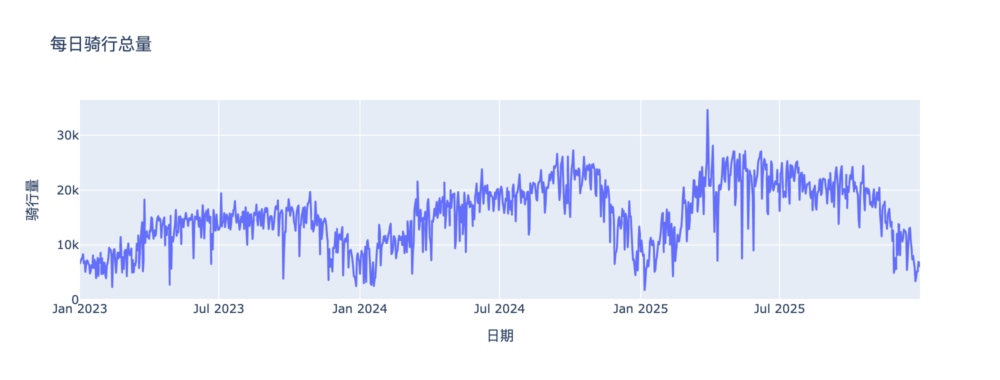

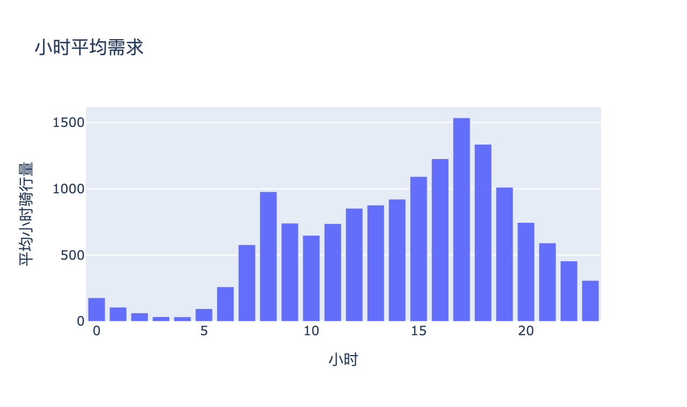{ width=49% }

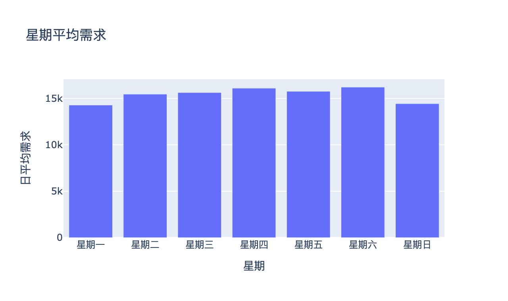{ width=49% }

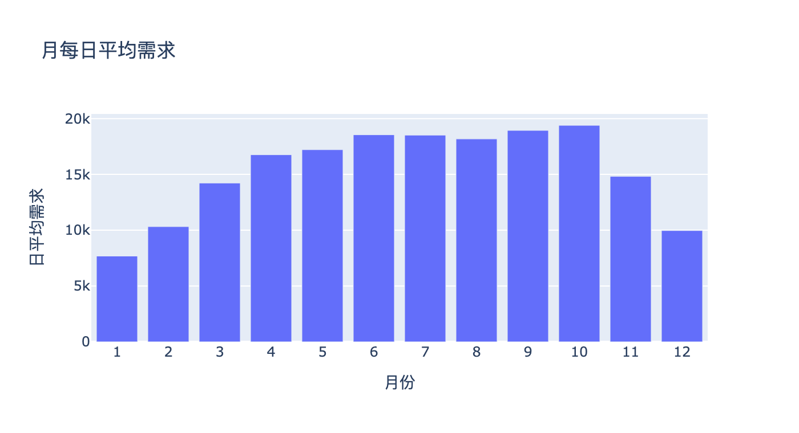{ width=58% }

三年间，需求规模与需求结构均出现明显变化。如表 3 所示，小时均值由 2023 年的 499 次/小时增至 2025 年的 743 次/小时；会员占比由 0.64 提升至 0.72，临时用户占比相应下降。其中，变化最显著的是电动车占比由 0.346 提升至 0.673，接近翻倍，经典车占比则持续下降。将这些结构性指标纳入特征后，模型能够学习车队电动化所带来的长期变化趋势。

Table: 逐年结构变迁。

| 年份 | 小时均值 `cnt` | 会员占比 | 临时占比 | 电动车占比 | 经典车占比 |
|---|---:|---:|---:|---:|---:|
| 2023 | 499.4 | 0.644 | 0.356 | 0.346 | 0.633 |
| 2024 | 682.3 | 0.676 | 0.324 | 0.597 | 0.403 |
| 2025 | 743.0 | 0.720 | 0.280 | 0.673 | 0.327 |

这种“强周期性 + 缓慢漂移”并存的特征，对应第 3 节中的特征设计，即滞后项与滚动统计用于刻画周期成分，天气协变量用于建模季节性与阈值效应，而构成比例特征则用于描述长期结构漂移。

# 特征工程与任务构建

## 特征表示

建模矩阵共包含 25 个数值特征，如表 4 所示，可根据其对应的需求分量划分为四类。

**周期时间**特征用于刻画周期结构，既包括离散变量 `hour`、`weekday`、`month` 与周末标识，也包括小时与星期的正弦、余弦编码。三角编码形式为
$$
h_{\sin}=\sin\!\left(\frac{2\pi h}{24}\right),\qquad
h_{\cos}=\cos\!\left(\frac{2\pi h}{24}\right)
$$
其作用在于使 23 时与 0 时、星期首尾等周期边界在特征空间中保持连续，从而避免模型将周期边界误识别为巨大的数值跳变。同样的编码方式也应用于 `weekday`。

**日历特征**用于建模节假日效应，其中 `is_holiday` 标识当日是否为法定假日，`is_pre_holiday` 与 `is_post_holiday` 分别标记假日前一天与后一天，以刻画节前需求提前释放与节后需求回流。三类变量均以 0/1 形式进入模型。

**天气与结构特征**用于描述季节性与需求构成变化，天气协变量包括 2 米气温 `temperature_2m`、相对湿度 `relative_humidity_2m`、降水量 `precipitation` 与 10 米风速 `wind_speed_10m`，均来自 `Open-Meteo` 并与小时需求对齐。结构特征方面，项目计算会员占比 `member_share`、临时用户占比 `casual_share`、电动车占比 `electric_share` 与经典车占比 `classic_share`，以反映用户类型与车型结构在 2023—2025 年间的演变。此外，`duration_mean_min` 与 `unique_start_stations` 作为运营侧摘要变量，刻画平均行程时长与每小时活跃起点站数量。

**自回归特征**用于捕获短期与多尺度记忆，包括代表上一小时需求的 `lag_1h`、代表昨日同小时需求的 `lag_24h`，以及分别对应过去一天与过去一周滚动均值的 `rolling_24h_mean` 与 `rolling_168h_mean`。所有滚动统计量均基于向后移一步后的目标序列计算，即
$$
\text{rolling\_}k\text{h\_mean}_t=\frac{1}{k}\sum_{j=1}^{k}\text{cnt}_{t-j}
$$
从而保证时刻 $t$ 的特征值不会接触 $\text{cnt}_t$ 本身。该移位机制构成整套特征工程的核心泄漏控制策略，并在各站点自身的净需求序列上保持一致。

Table: 25 维特征表示。

| 族 | 特征 | 作用 |
|---|---|---|
| 周期时间 | `hour`、`weekday`、`month`、`is_weekend`、`hour_sin/cos`、`weekday_sin/cos` | 日、周周期性 |
| 日历 | `is_holiday`、`is_pre_holiday`、`is_post_holiday` | 节假日效应 |
| 天气 | `temperature_2m`、`relative_humidity_2m`、`precipitation`、`wind_speed_10m` | 季节、阈值效应 |
| 结构 | `member_share`、`casual_share`、`electric_share`、`classic_share` | 用户、车队漂移 |
| 运营 | `duration_mean_min`、`unique_start_stations` | 活动摘要 |
| 自回归 | `lag_1h`、`lag_24h`、`rolling_24h_mean`、`rolling_168h_mean` | 惯性与周期模板 |

## 需求与天气的关系

在小时尺度上，需求与天气变量之间的线性相关总体有限。如图 5 所示，气温与需求呈中等正相关（$r\approx0.46$），湿度呈中等负相关（$r\approx-0.44$）；相比之下，降水与风速几乎不表现出显著线性关系（$|r|\lesssim0.05$）。

降水相关性的微弱本身具有解释价值，因为其对需求的影响更接近一种阈值式、日尺度发挥作用的机制。降雨往往影响的是整日出行决策，而非单小时需求波动，因此小时级皮尔逊相关容易低估其真实作用。基于这一观察，第 6.2 节进一步引入日尺度情景分析。同时，降水与风速仍被保留为模型特征，以使树模型能够捕获线性相关之外的非线性关系及交互效应。

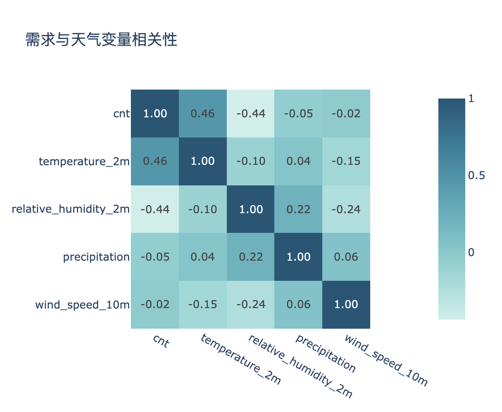{ width=58% }

## 训练与测试划分

所有模型均采用相同的时间顺序 80/20 划分：前 21,043 个小时用于训练，覆盖至约 2025 年中；后续 5,261 个小时作为测试集，对应最后约 7 个月的数据。本研究未采用随机划分，因为随机采样会导致自回归特征引入未来信息泄漏。例如，在打乱后的数据上构造 `rolling_168h_mean` 时，训练样本对应的滚动窗口可能包含时间上位于测试区间的观测值。时间顺序划分既符合“利用历史预测未来需求”的实际部署方式，也保证所有模型在相同测试窗口上进行比较，从而使模型间差异能够归因于模型设计本身，而非数据划分策略。

# 方法

## 城市总体需求预测模型

城市级预测对比涵盖从简单基线到深度模型的六类方法，其定位与核心特点如表 5 所示。Seasonal naive 直接将昨日同小时需求 `lag_24h` 作为预测值，在缺失情况下回退至训练集均值。作为基线模型，它代表了任何学习模型都需要超越的参考标准；由于需求本身具有显著日周期，该基线本身已具备较强竞争力。Ridge 在标准化后的特征空间中拟合线性关系，用于衡量需求信号能够被线性关系解释的程度。Random Forest、HistGradientBoosting 与 XGBoost 分别代表 Bagging 与两种梯度提升实现，用于捕捉非线性与特征交互。LSTM 则利用过去 24 小时的完整特征序列预测下一小时需求，作为深度时序建模方法的代表进行比较。考虑到需求本身非负，所有模型输出均在零处进行截断。

Table: 城市级预测模型概览。

| 模型 | 类别 | 关键设置 |
|---|---|---|
| Seasonal naive | 周期基线 | 使用 lag_24h(昨日同小时)作为预测 |
| Ridge | 线性 | StandardScaler + Ridge($\alpha=1$) |
| Random Forest | 集成树 | 200 棵树，`min_samples_leaf=2` |
| HistGradientBoosting | 梯度提升 | `max_iter=300`，`learning_rate=0.06` |
| XGBoost | 梯度提升 | 350 轮，`max_depth=4` |
| LSTM | 深度时序 | 24 小时窗口，隐藏 64，35 轮 |

## LSTM 时序建模

LSTM 由 `src/bikeshare/lstm_model.py` 实现，与树模型共用同样的 25 个特征，序列回看长度为 24 小时；序列由在连续小时索引上滑动一个 24 步窗口生成，以保证每个训练样本均为一段真实的 24 小时历史。输入与目标仅用训练部分的统计量作标准化，预测再经逆变换并截断。网络为一层宽度 64 的 LSTM，其后接一个 $64\to 32\to 1$、含 ReLU 的两层 MLP 头；优化器为 AdamW，学习率 $10^{-3}$、权重衰减 $10^{-4}$，共训练 35 轮，损失采用对峰值离群更稳健的 Smooth-L1 损失，又称 Huber 损失，并辅以 1.0 的梯度范数裁剪，批大小为 128。训练在具备 CUDA 时优先使用 GPU；本仓库最近一次全量训练的相关记录见 `models/training_info.json` 中的 lstm 字段，包括设备类型、训练轮数与末轮损失。需要强调的是，LSTM 在本项目中定位为深度学习对照实验，而非唯一主模型：在已人工构造强滞后、强周期特征的前提下，端到端序列模型相对梯度提升树的边际优势往往有限，第 6.3 节的实验结果亦验证了这一点。

## 站点级净需求预测

站点级预测面向流量排名前 20 的站点，分别训练 Ridge、随机森林、HGB 与 XGBoost 四类模型。考虑到需要进行二十个独立站点的重复训练，站点级实验未纳入 LSTM，以控制整体训练开销。对于每个站点，其时间序列首先被重索引至连续小时网格，再连接城市级天气信息，并构造与城市级任务一致的日历与周期特征。与此同时，所有滞后项与滚动统计均基于站点自身净需求序列计算，从而保证自回归信息保持局部性。由于单站任务具有样本规模较小、噪声更高的特点，站点级树模型采用更轻量的参数设置：随机森林包含 120 棵树，HGB 使用 `max_iter=220`，XGBoost 使用 220 轮 boosting，并将树深限制为 3。

## 站点画像与调度逻辑

为支持站点级调度分析，`src/bikeshare/station_clustering.py` 首先构建站点画像。项目使用十项统计指标描述各站点特征，包括总流量、净需求均值与绝对均值、峰值净流出与峰值净流入、早高峰（6–10 时）与晚高峰（16–19 时）的平均净需求、周末流量占比以及借还比。所有指标经过标准化处理后输入 K-Means 聚类模型，设置 $k=4$ 且 `n_init=20`，并依据聚类中心特征自动赋予通勤流出型、通勤流入型、景点休闲型与混合型标签。

调度建议由 `src/bikeshare/dispatch.py` 自动生成，其判定规则建立在净需求定义之上。由于 `net_demand=pickup-dropoff`，正的净需求均值意味着车辆长期净流出，即站点库存存在持续下降趋势。因此，净需求均值高于 $+0.25$ 的站点被标记为优先补车，低于 $-0.25$ 的站点被标记为优先清车，其余站点则维持观测状态。

最终输出按照峰值不平衡程度排序：
$$
\text{imbalance}=|\text{peak\_outflow}|+|\text{peak\_inflow}|
$$
并仅保留评分最高的 15 个站点，以聚焦最显著的不平衡节点。

## Dashboard 系统设计

交互系统采用 Streamlit 五页签结构。「数据概览」集中展示样本规模、日/小时需求、天气相关性、节假日与星期/月度对比，以及天气情景日需求柱状图。「需求预测」支持选择模型、测试窗口起止日期与展示天数，绘制城市级真实值与预测值曲线及误差分布，并提供站点净需求预测动画与天气情景系数调整。「模型对比」页读取 `models/metrics.json` 展示 MAE、RMSE、MAPE、$R^2$ 指标表与柱状图，并显示 LSTM 训练信息。「站点详情」页集成调度建议表、聚类画像、基于 OpenStreetMap 的站点热力图，以及单站真实净需求与模型预测对比曲线。「项目说明」页汇总数据来源、运行命令与指标 JSON，便于答辩时快速查阅。天气情景按日归类规则为：日累计降水 $\ge 0.5$ mm 为降水，日最高温 $\ge 30\,^{\circ}\mathrm{C}$ 为高温，日最低温 $\le 5\,^{\circ}\mathrm{C}$ 为低温，日最大风速 $\ge 25$ km/h 为大风，其余为常规天气；该逻辑与第 6.2 节定量分析一致。

# 实验设计与评价指标

## 实验设计

实验默认使用 2023-2025 三年全量数据。城市级任务预测全系统每小时出发量 `cnt`；站点级任务预测 `Top 20` 站点的小时净需求。所有模型在相同时间切分与相同测试集上评估，以保证对比公平。

## 评价指标

设真实值为 $y_i$、预测值为 $\hat y_i$、测试样本数为 $n$，则
$$
\text{MAE}=\frac{1}{n}\sum_{i=1}^{n}\lvert y_i-\hat y_i\rvert,\qquad
\text{RMSE}=\sqrt{\frac{1}{n}\sum_{i=1}^{n}\bigl(y_i-\hat y_i\bigr)^2},
$$
$$
\text{MAPE}=\frac{100}{n}\sum_{i=1}^{n}\frac{\lvert y_i-\hat y_i\rvert}{\max(\lvert y_i\rvert,1)},\qquad
R^2=1-\frac{\sum_i\bigl(y_i-\hat y_i\bigr)^2}{\sum_i\bigl(y_i-\bar y\bigr)^2}.
$$

RMSE 对较大的预测误差施加二次惩罚，因此被选作主要模型选择依据，其原因在于运营成本最高的错误通常来自对需求高峰的严重低估。为避免接近零的夜间需求导致分母过小，MAPE 的分母在 1 处进行截断。即便如此，低流量时段仍会对 MAPE 产生放大效应，因此本研究始终将其与 MAE 和 RMSE 联合解读，而不单独使用。此外，树模型统一固定 `random_state=42`，其结果基本可重复；相比之下，LSTM 存在真实的运行间随机波动。下表所列结果对应原始实验报告中的单次运行输出，重复执行时第三位小数附近出现轻微波动属于预期现象。

# 实验结果

## 城市级需求规律

第 2.4 节所观察到的描述性结构在模型结果中得到较好体现，包括显著的双峰日周期、相对较弱的工作日与周末差异，以及明显的年度季节性。节假日效应则通过显式特征直接纳入模型。如图 6 所示，节假日的日均需求显著低于非节假日，这与需求曲线中占主导地位的通勤高峰在假日期间减弱相一致。此外，节前、节后两个指标进一步帮助模型区分假日本身与其邻近日期，从而使较低需求的假日能够与前后更繁忙的出行日相分离。

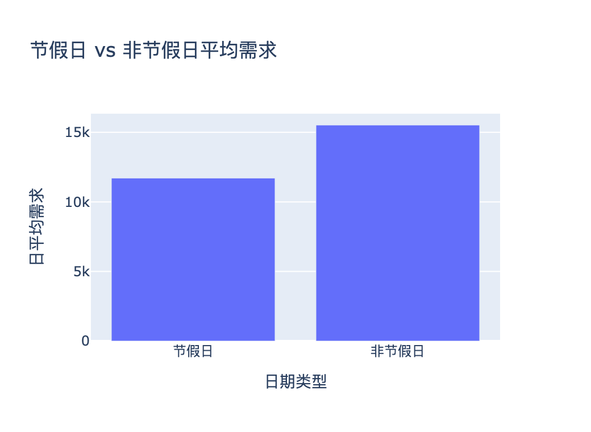{ width=46% }

## 天气情景分析

根据预定义规则对每个日历日进行分类，并以常规日作为基准对日均需求进行归一化，可得到表 6 与图 7 所示的相对需求系数。低温日与降水日表现出最明显的抑制作用，其需求水平分别仅为常规日的 0.60 倍与 0.75 倍；高温日略低于常规水平，为 0.94 倍。相比之下，大风类别仅包含 15 个样本，其接近于 1 的结果应结合较小样本规模谨慎解读。所有系数均基于 `hourly_demand.csv`，按照 Dashboard 所采用的日级规则确定性计算得到。具体而言，日降水量不少于 0.5 mm 定义为降水日，日最高温不低于 $30\,^{\circ}\mathrm{C}$ 定义为高温日，日最低温不高于 $5\,^{\circ}\mathrm{C}$ 定义为低温日，日最大风速不低于 25 km/h 定义为大风日，并按照上述优先顺序进行判定。Dashboard 亦使用相同系数对站点预测进行情景缩放。其中，低温效应在运营层面尤需关注，低温日需求仅为常规水平的约 60%，意味着寒潮事件可能导致约四成需求损失；若再叠加图 4 所示的 1 月季节性低谷，两者共同作用将形成全年利用率最低的时段。

Table: 天气情景与日平均需求相对倍数。

| 天气情景 | 相对常规天气倍数 | 样本天数 | 解读 |
|---|---:|---:|---|
| 常规天气 | 1.00 | 304 | 基准 |
| 大风 | 1.00 | 15 | 样本少，接近基准 |
| 高温 | 0.94 | 78 | 略低于常规 |
| 降水 | 0.75 | 439 | 明显抑制 |
| 低温 | 0.60 | 260 | 抑制最强 |

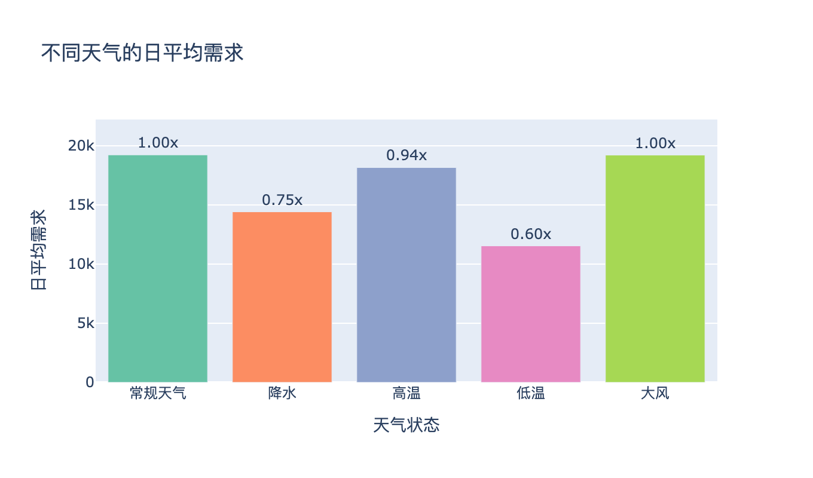{ width=62% }

## 城市级模型结果

表 7 给出测试集上的对比，并由图 8 予以可视化。

Table: 城市级测试集表现，按 RMSE 排序，每列最优者加粗。

| 模型 | MAE | RMSE | MAPE (%) | $R^2$ | 说明 |
|---|---:|---:|---:|---:|---|
| **HistGradientBoosting** | **84.29** | **116.95** | **15.23** | **0.964** | **RMSE 最优** |
| XGBoost | 88.28 | 122.70 | 16.16 | 0.960 | 次优集成树 |
| LSTM | 84.19 | 127.27 | 17.90 | 0.957 | MAE 接近 HGB，RMSE 偏高 |
| Random Forest | 96.87 | 143.32 | 16.04 | 0.945 | 弱于提升树 |
| Ridge | 114.35 | 156.61 | 31.68 | 0.935 | 线性可解释 |
| Seasonal naive | 188.54 | 300.74 | 42.71 | 0.759 | 周期基线 |

表 7 的结果体现出四个主要结论。其一，学习模型显著优于周期基线。HGB 将基线 RMSE 由 300.74 降至 116.95，同时将 $R^2$ 从 0.759 提升至 0.964，说明仅依赖“昨日同小时”难以充分刻画天气变化以及表 3 所示的结构漂移。其二，梯度提升方法在树集成模型中表现最佳。HGB 在各项指标上均取得最优结果，XGBoost 次之；两种梯度提升实现得到一致结论，说明实验结果并不依赖于某一种具体实现。其三，Ridge 仍达到 $R^2=0.935$，但其 MAPE 高达 31.68%，约为树模型的两倍，说明线性模型虽然能够捕获总体水平，却难以拟合需求峰值及天气因素带来的非线性交互。其四，LSTM 呈现出明显的指标背离现象。其 MAE 为 84.19，与 HGB 几乎持平，但 RMSE 高达 127.27，说明误差主要集中于少数高需求峰值时段，并在 RMSE 的平方惩罚机制下被进一步放大。在强工程特征已经注入的前提下，序列模型难以在 RMSE 上取得明显优势，这与第 4.2 节中的预期一致。

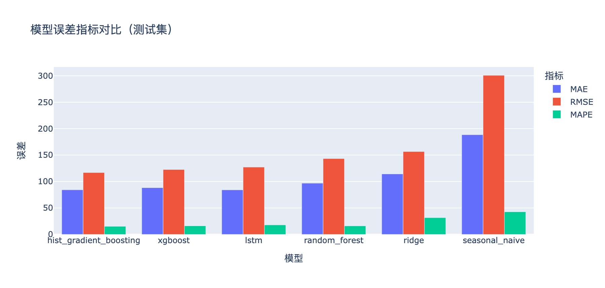{ width=82% }

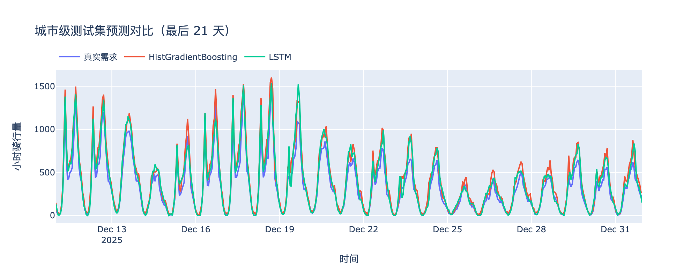

如图 9 所示，在最后 21 个测试日上叠加真实序列与 HGB、LSTM 的预测，两者均较好复现了需求的双峰结构，仅在最陡峭的峰值处出现轻微欠拟合，与 RMSE 指标所反映的结论一致。

如图 10 所示，HGB 在整个测试集上的误差分布呈现集中、单峰且近似对称的形态，并以零为中心分布。这表明模型不存在明显系统性偏差，既未长期高估，也未长期低估，因此误差主要来源于峰值时段的随机波动，而非整体水平偏移。

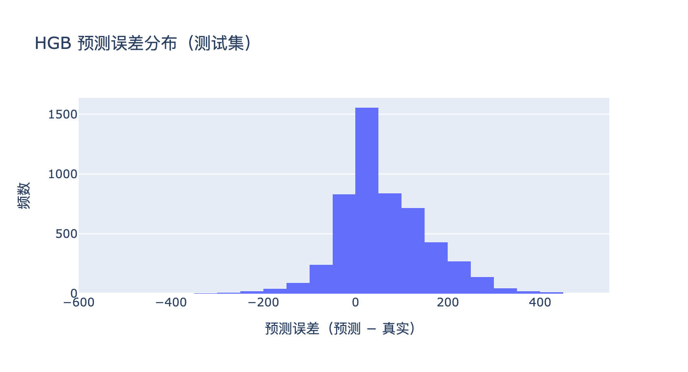{ width=58% }

## 站点级模型结果

对二十个站点取平均后，测试集 RMSE 分别为 HistGradientBoosting 2.73、Random Forest 2.77、XGBoost 2.80、Ridge 2.88，其中梯度提升方法仍取得最佳整体表现，如图 11 所示。各站点的 HistGradientBoosting 结果列于表 8，可见站点间存在明显异质性。RMSE 范围由 6th & H St NE 的 2.14 延伸至最大交通枢纽 Columbus Circle / Union Station 的 3.89；前者属于需求模式较规律的小型住宅站。站点级任务的 $R^2$ 明显低于城市级任务，其中 HistGradientBoosting 的平均 $R^2$ 约为 0.22，而需求最稀疏的站点甚至低至 0.06。这一结果符合预期。从方差角度看，将多个站点聚合为城市总需求后，各站特有的异质噪声会被部分抵消，因此城市级目标的信噪比天然高于单站任务；相比之下，单站净需求本身只是一个波动幅度较小的带符号变量。

值得注意的是，Columbus Circle 同时具有最高 RMSE 与最高 $R^2$，后者达到 0.44。这意味着该站点虽然波动幅度更大，但同时具有更明显的可预测结构，因此模型能够在更大的总体方差中解释更高比例的变化。站点表略去 MAPE，原因在于净需求会穿越零点，此处百分比误差无从定义，截断后的 MAPE 亦随之失去意义。

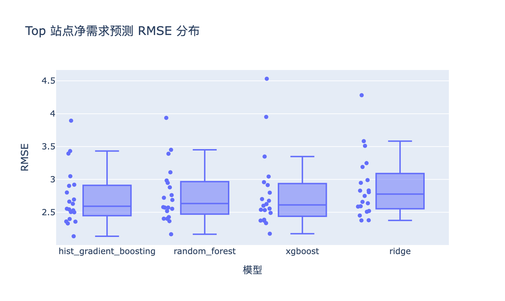{ width=58% }

Table: 逐站 HGB 净需求表现，覆盖 Top 20 站点，按 RMSE 排序。

| # | 站点 | MAE | RMSE | $R^2$ | # | 站点 | MAE | RMSE | $R^2$ |
|--:|---|--:|--:|--:|--:|---|--:|--:|--:|
| 1 | 6th & H St NE | 1.44 | 2.14 | 0.35 | 11 | 14th & Irving St NW | 1.80 | 2.63 | 0.12 |
| 2 | 1st & M St NE | 1.64 | 2.33 | 0.15 | 12 | 14th & R St NW | 1.84 | 2.66 | 0.23 |
| 3 | 15th & W St NW | 1.65 | 2.36 | 0.31 | 13 | Jefferson Dr & 14th St SW | 1.62 | 2.69 | 0.14 |
| 4 | 11th & M St NW | 1.65 | 2.36 | 0.34 | 14 | 15th & P St NW | 1.97 | 2.80 | 0.19 |
| 5 | 8th & O St NW | 1.65 | 2.40 | 0.18 | 15 | Lincoln Memorial | 1.73 | 2.90 | 0.11 |
| 6 | 4th & Florida Ave NE | 1.72 | 2.50 | 0.06 | 16 | 5th & K St NW | 2.05 | 2.92 | 0.29 |
| 7 | 17th & Corcoran St NW | 1.70 | 2.50 | 0.21 | 17 | 4th St & Madison Dr NW | 1.80 | 3.05 | 0.25 |
| 8 | M St & Delaware Ave NE | 1.75 | 2.53 | 0.10 | 18 | 14th & V St NW | 2.37 | 3.39 | 0.24 |
| 9 | Adams Mill & Columbia Rd NW | 1.75 | 2.54 | 0.14 | 19 | New Hampshire Ave & T St NW | 2.47 | 3.43 | 0.21 |
| 10 | 37th & O St / Georgetown | 1.69 | 2.55 | 0.33 | 20 | Columbus Circle / Union Station | 2.68 | 3.89 | 0.44 |

如图 12 所示，模型能够较好跟随 Columbus Circle 的逐日大幅波动，但对于最极端的需求尖峰仍存在明显低估，这与其同时表现出较高 RMSE 与较高 $R^2$ 的结果相一致。

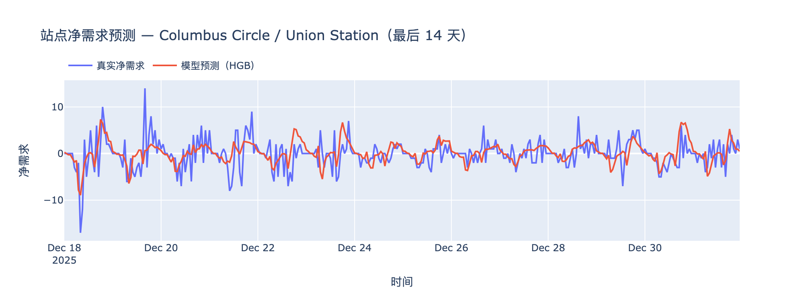

## 调度建议与站点聚类

K-Means 聚类结果显示，混合型站点数量最多，共 12 个，其后依次为景点休闲型 5 个、通勤流出型 2 个以及通勤流入型 1 个，其分布如图 13 所示。聚类中心见表 9，其中早、晚高峰净需求的符号构成了区分不同类别最具解释性的行为特征。唯一的通勤流入枢纽 Columbus Circle 在早高峰表现出显著负净需求，达到 $-0.76$，对应早高峰时段大量车辆流入；晚高峰则转为正值（$+0.52$），反映晚间车辆净流出。与此同时，其周末流量占比最低，仅为 0.20，因此表现出典型目的地站特征。两个通勤流出站则呈现相反模式：早高峰净需求为正（平均约 $+0.27$），净需求均值亦最高，达到 $+0.46$，体现出典型居住区起点站特征，即车辆在清晨持续净流出。景点休闲组具有最高周末流量占比（0.35），需求更多集中于日间活动时段；相比之下，混合组整体上更接近平衡状态。各类别的代表站点进一步体现出上述差异：通勤流出型包括 14th & Irving St NW 与 Adams Mill & Columbia Rd NW；通勤流入型对应 Columbus Circle / Union Station；景点休闲型则包括 Lincoln Memorial、4th St & Madison Dr NW 与 Jefferson Dr & 14th St SW。

Table: K-Means 聚类中心，按成员站取均值。

| 聚类 | 站数 | 净需求均值 | 周末占比 | 早高峰净 | 晚高峰净 | 平均流量 |
|---|--:|--:|--:|--:|--:|--:|
| 通勤流出型 | 2 | +0.46 | 0.31 | +0.27 | −0.07 | 17.6 万 |
| 通勤流入型 | 1 | −0.04 | 0.20 | −0.76 | +0.52 | 31.6 万 |
| 景点休闲型 | 5 | −0.08 | 0.35 | −0.37 | +0.23 | 16.9 万 |
| 混合型 | 12 | −0.00 | 0.31 | +0.38 | −0.30 | 20.1 万 |

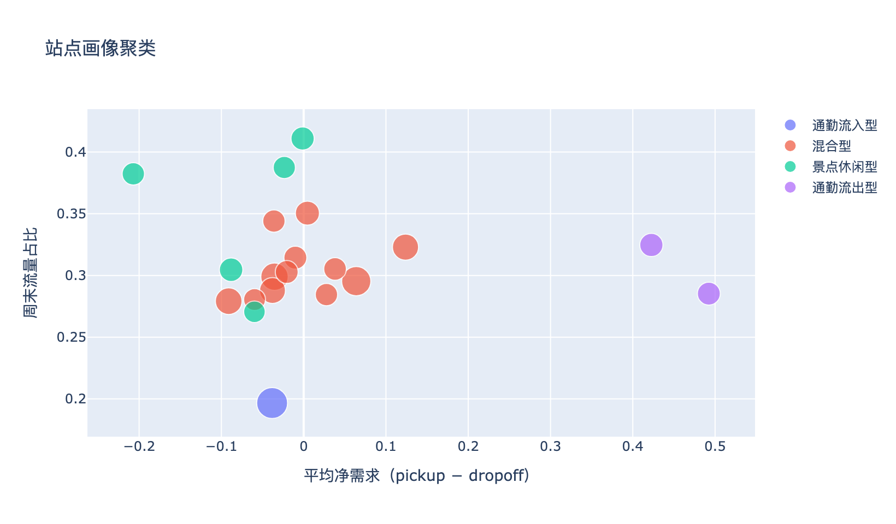{ width=72% }

调度建议见表 10，数据来源于 reports/tables/dispatch_recommendations.csv，并按照峰值不平衡评分排序。在 $\pm0.25$ 的阈值下，14th & Irving St NW 是唯一触发优先补车策略的站点，其净需求均值约为 0.49，与其通勤流出型标签一致；没有站点触发优先清车，其余进入前 15 名的站点均被标记为保持观测。更重要的是，这一结果体现出两类信号之间的互补性。Columbus Circle 的全时段净需求均值仅为 $-0.04$，整体上接近平衡，但其单小时最大净流出达到 29，最大净流入达到 $-45$。如表 9 所示，该站点早晚高峰的净流向在日均值层面相互抵消，但在小时尺度上却表现出幅度巨大且方向相反的波动。这意味着，仅依据日均值进行静态补车策略可能忽略最繁忙的交通枢纽；对于此类站点，更合理的策略是在高峰时段实施定向调度。相比之下，Adams Mill & Columbia Rd NW 则表现出典型通勤流出站特征，其净需求均值达到 0.42，但由于峰值不平衡程度较低，最终未进入前 15 名。由此可见，聚类标签与不平衡排序刻画的是两个不同但互补的维度。如图 14 所示，若干显著净流出站主要分布于核心城区以北的居住走廊，而市中心交通枢纽在整体时段上的净需求反而更接近平衡。

Table: 调度建议前若干站点，按峰值不平衡评分排序。

| 站点 | 净需求均值 | 峰值流出 | 峰值流入 | 不平衡 | 动作 |
|---|--:|--:|--:|--:|---|
| Columbus Circle / Union Station | −0.04 | 29 | −45 | 74 | 保持观测 |
| Jefferson Dr & 14th St SW | −0.21 | 28 | −41 | 69 | 保持观测 |
| 4th St & Madison Dr NW | −0.02 | 27 | −29 | 56 | 保持观测 |
| 14th & V St NW | +0.12 | 28 | −24 | 52 | 保持观测 |
| Lincoln Memorial | −0.00 | 22 | −22 | 44 | 保持观测 |
| New Hampshire Ave & T St NW | +0.06 | 22 | −22 | 44 | 保持观测 |
| M St & Delaware Ave NE | −0.09 | 21 | −20 | 41 | 保持观测 |
| 14th & Irving St NW | +0.49 | 23 | −14 | 37 | **优先补车** |

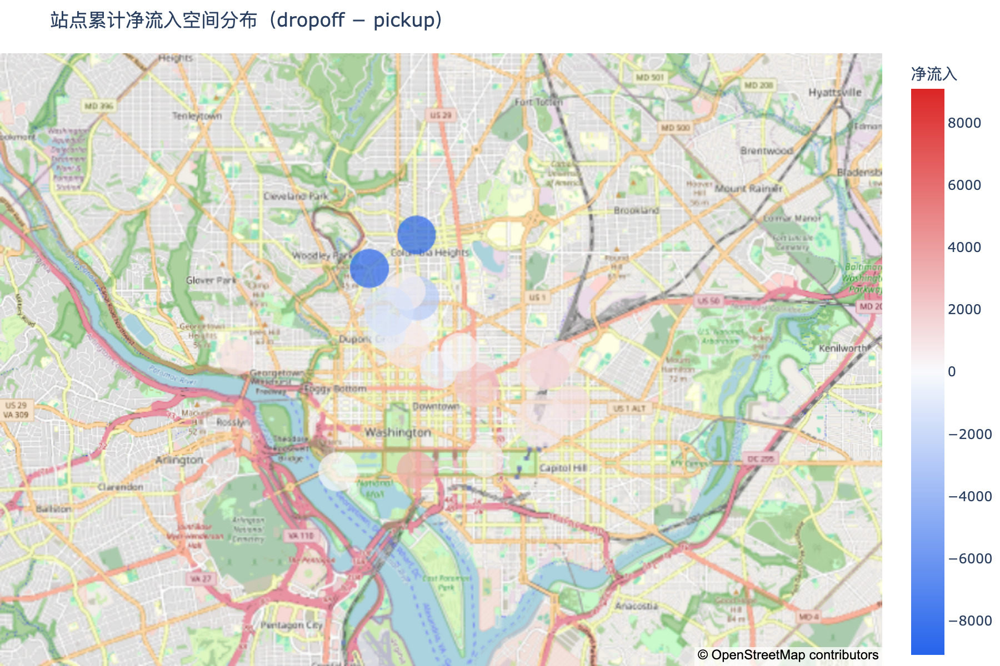{ width=88% }

# 讨论

## 模型表现分析

HGB 的优势可从以下几方面理解。其一，特征工程已将三年小时历史转化为信息密度较高的表格表示，目标变量与其滞后项及滚动统计高度相关。在此类数据上，提升树不仅能够高效学习表 6 所体现的阈值效应，例如降水与低温带来的需求转折，也能够捕获周末与小时、气温与月份等特征交互，并适应峰值阶段更强的异方差性，同时对特征尺度保持不敏感。其二，LSTM 的优势在于从原始序列端到端学习表示，但当领域知识已经将主要结构显式编码后，其能够补充的有效信号有限；此外，本研究中的训练均在 CPU 环境下完成，这亦可能对收敛表现产生轻微影响。第 6.3 节所观察到的 MAE 与 RMSE 背离，以及图 10 中集中、对称的误差分布，共同表明残余误差主要集中于少数需求峰值。因此，后续建模更应关注峰值时段，而非平均需求水平。

## 可解释性

模型行为与特征设计之间存在较清晰的对应关系。自回归特征刻画短期惯性以及日、周层面的重复模式；周期编码刻画通勤节律；天气协变量连同表 6 所示的需求系数，共同反映降水与低温对出行行为的抑制作用；而构成占比则刻画表 3 所呈现的车队电动化漂移。这种结构上的对应关系，使模型预测不仅具备较高准确性，同时具有较好的解释能力，从而便于运营人员理解模型判断依据。

## 系统应用价值

除模型与分析结论之外，本项目的交互式 Dashboard 进一步将离线结果转化为面向运营的决策支持工具，其价值主要体现在三个层面。其一，在需求侧，「需求预测」页允许运营人员选定模型与时间窗口，直观查看未来若干小时城市级需求的变化趋势，并借助天气情景系数对降水、低温等不利天气下的需求下行进行快速预判，从而为运力调配与人员排班提供前瞻性参考。其二，在调度侧，「站点详情」页将站点画像、聚类标签与按峰值不平衡排序的调度建议表整合呈现，使运营人员能够迅速识别需要重点补车或清车的站点，并区分日均失衡与高峰定向调度两类不同的干预需求，从而提升调度优先级判断的效率。其三，在展示侧，系统将数据概览、模型对比与站点分析集成于同一界面，既便于在课堂答辩与项目汇报中演示完整的数据挖掘流程，也便于向非专业听众解释模型判断依据与业务含义。需要说明的是，上述定位为辅助分析与决策支持，而非自动化的在线调度执行，其边界条件已在第 7.4 节中讨论。

## 局限性

本研究仍存在若干局限。其一，数据仅来自单一城市系统，因此结论向其他城市推广时需保持谨慎。其二，所采用的天气变量来源于历史观测而非天气预报，因此本文报告的误差更接近前瞻性能的上界；Dashboard 中的情景系数亦仅用于解释性情景缩放，而非经过严格标定的预测输入。其三，站点级建模仅覆盖 Top 20 高流量站点，信噪比较低的长尾站点尚未纳入分析。其四，模型未引入地铁接驳、大型活动、道路施工等外部 POI 信号，而这些因素很可能正是站点级残余尖峰的重要来源。最后，调度输出仍建立在透明的均值与峰值规则之上，并未纳入车辆库存、调度容量及路径约束，因此不宜被直接视作可上线部署的调度指令。

# 结论

本项目在 1,688 万次骑行与 26,304 个小时样本之上，构建并评估了一条完整分析管道，覆盖多源融合、特征工程、六模型城市级预测、站点级净需求建模、聚类分析、调度逻辑以及交互式 Dashboard。HistGradientBoosting 是城市级任务中表现最优的模型，其 RMSE 为 116.95、$R^2$ 为 0.964；相较周期基线具有显著优势，相较 LSTM 则保持稳定领先，其残余误差主要集中于需求峰值阶段。除模型比较之外，本项目还记录了明显的车队电动化漂移——电动车占比由 0.35 提升至 0.67；量化了天气弹性，其中低温与降水分别对应常规水平的 0.60 倍与 0.75 倍需求；并进一步表明，在站点层面，平均净需求与峰值不平衡反映的是两类不同但互补的运营信号，只有结合二者，才能形成可操作且面向交通枢纽的调度建议。

# 未来工作

上述局限自然引出若干拓展方向。其一，以实时天气预报替代历史观测，将当前回溯性评估转变为真正的 24–72 小时前瞻预测，并检验模型性能在预报不确定性下能够保留多少。其二，将研究范围由 Top 20 站点扩展至全网乃至其他城市，并借助迁移学习或参数共享机制，使单独信号较弱、难以独立建模的站点能够共享统计结构。其三，针对第 6.3 节所揭示的峰值误差，引入能够显式建模空间依赖的模型，例如时空图网络或 Temporal Fusion Transformer，而非将各站点视作相互独立。其四，将当前基于均值与峰值规则的调度逻辑扩展为包含库存约束、容量约束与路径优化的决策系统，以缩小分析结果与实际可执行调度方案之间的距离。其五，引入 SHAP 等归因方法提升模型可审计性；一旦模型输出被用于指导真实车辆与人员调度，这种可解释与可追溯能力将变得尤为重要。

# 参考文献 {-}

1. Capital Bikeshare. *System Data*. <https://capitalbikeshare.com/system-data>
2. Open-Meteo. *Historical Weather API*. <https://open-meteo.com/en/docs/historical-weather-api>
3. Pedregosa, F. et al. *Scikit-learn: Machine Learning in Python.* JMLR 12:2825–2830, 2011.
4. Chen, T. and Guestrin, C. *XGBoost: A Scalable Tree Boosting System.* KDD, 2016.
5. Ke, G. et al. *LightGBM: A Highly Efficient Gradient Boosting Decision Tree.* NeurIPS, 2017.
6. Hochreiter, S. and Schmidhuber, J. *Long Short-Term Memory.* Neural Computation 9(8):1735–1780, 1997.
7. Lim, B. et al. *Temporal Fusion Transformers for Interpretable Multi-horizon Time Series Forecasting.* Int. J. Forecasting, 2021.
8. Fanaee-T, H. and Gama, J. *Event Labeling Combining Ensemble Detectors and Background Knowledge.* Progress in AI, 2014.


# 附录 A：运行命令 {-}

```bash
python -m pip install -r requirements.txt          # 依赖
python -m bikeshare.pipeline                        # 全量运行，含下载、训练、导出
python -m bikeshare.pipeline --months 202401        # 单月烟测
streamlit run app/dashboard.py                      # Dashboard
python scripts/make_report_figures.py                  # 重新生成报告图，需 kaleido
```

# 附录 B：核心输出清单 {-}

| 路径 | 内容 |
|---|---|
| `models/metrics.json` | 城市级模型指标 |
| `models/predictions.csv` | 城市级测试集预测 |
| `models/station_predictions.csv` | 站点净需求预测 |
| `models/training_info.json` | 划分规模、特征列、LSTM 记录 |
| `reports/tables/dispatch_recommendations.csv` | 调度建议 |
| `reports/tables/station_clusters.csv` | 站点聚类画像 |
| `reports/tables/station_model_metrics.csv` | 各站点模型指标 |

# 附录 C：成员分工 {-}

| 成员 | 学号 | 职责 | 主要产出 |
|---|---|---|---|
| 任泓臻 | 2351458 | 数据工程 | `data.py`，清洗与天气融合 |
| 虞澍 | 2352979 | 算法 | `features.py`、`modeling.py`、XGBoost 实验 |
| 黄彦炜 | 2353117 | 深度学习 | `lstm_model.py`，训练记录与对比分析 |
| 马小龙 | 2353814 | 工程与展示 | `dashboard.py`、`reporting.py`，图表与调度表 |
